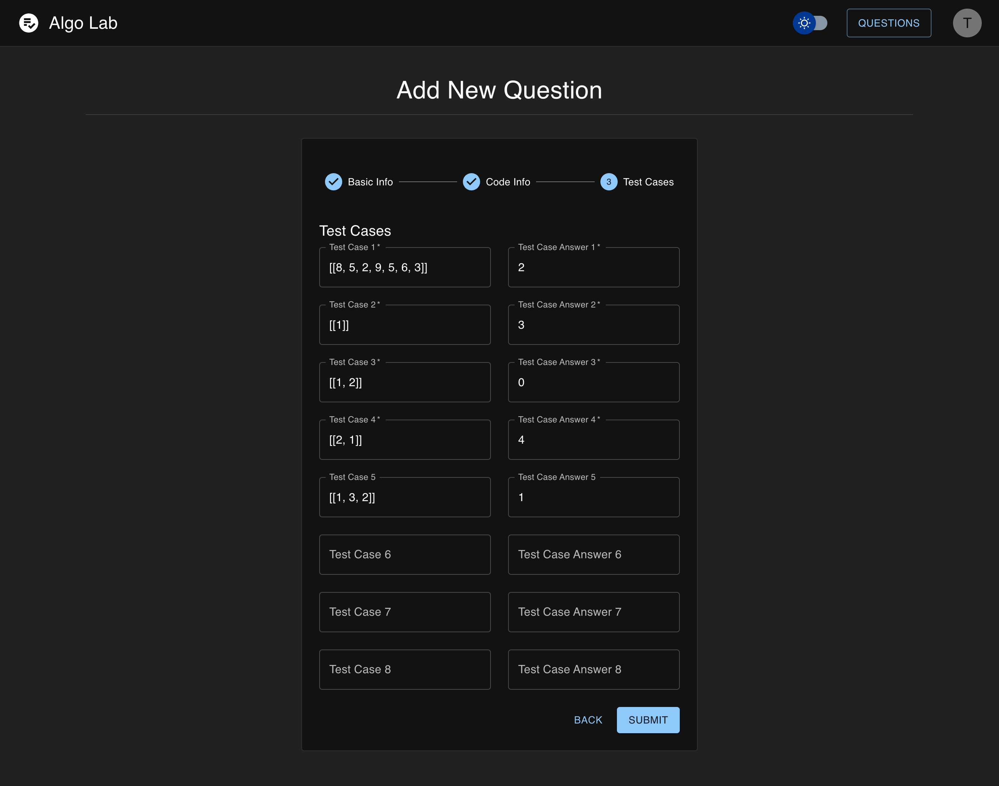

<div id="top"></div>

<!-- PROJECT LOGO -->
<br />
<div >
<div align="center" >
  <a href="https://github.com/github_username/repo_name">
    
  </a>
  </div>

# Algo Lab

<p>
    At UCL, first-year computer science students have labs every Wednesday. In the labs, we have to work on algorithm questions. We have to set up our own IDE environment, Create our own test case, and always wonder this is the correct answer to the question. Wondering if there is any test case that will break my solution.
</p>
<p>
    The TAs have a hard time helping the student when it comes to assisting them in debugging their bugs. They need to see line by line code that will. Try to wonder in what way they can help the students to improve their solutions. For lab groups that have Online meetings is even harder for them to interact with the student. Sharing their screen to see students’ mistakes is so much of a hassle and hardly implemented.
</p>
<p>
    This app will help students and TAs to overcome all of the problems mentioned by providing a much more efficient way to help students to learn algorithms by providing them online IDE, visualiser, test cases, video explanation, and efficient solutions.

</p>
<!-- ABOUT THE PROJECT -->

# Demo

This is Login, You can use local email and password or sign in with the UCL portal.


If you click the UCL portal it will redirect you to the UCL Portal and you need to put ucl credentials.


This is register for local account.


It will check and sanitised the input. The email must be a valid email & password length must be greater than 8.

It will also check if the email you want to register is already in the database or not. No duplicate.

If successful, it will redirect to the login page.


Login also works the same way. It will check the email and password.


It will also check if the credentials are valid.


If successful it will redirect you to the main page.


You can see all of the students that registered in the module (app) and their progress of how many questions they have solved so far.


You can see all of the Teachers that you can contact to ask further questions about the topic. It will also shows module tutors that are responsible for this algorithm problems material.


### IDE Flow

When you click to solve the challenge, it will redirect you to the problem question.

It has a question prompt about what the question is about.

The IDE is where you can type your answer.


Each question has a visualiser that will help the user gain a better understanding of the algorithm that they will implement.


After you try to do the question. Run it by pressing the button “RUN CODE”.

It will check against the provided test cases. You can see what your output is versus the expected output (answer).

It will be send to the backend in order to be run in the backend using Python Shell and then will be tested against the test case.


You can use the “Print Output” section to debug your solution using print statement.


If you are stuck with your solution, you can see the video explanation


Or You can read the available solution.


If you get every test case right, it will save the progress to the database


So when you go back to the main page, it will show that it is solved


### Teacher Flow

As a teacher, if you want to register yourself as a teacher, you will need to provide the teacher code in order to be assigned a teacher role.


Then if it is successful it will redirect to the login page.


The difference if you are a teacher role is that “Add Question” button will appear.


When you click “Add Question” button, it will redirect you to the “Add New Question” page


Fill the Basic Info and the question prompt in a markdown format.


Solution Video from youtube embed link.

Starter Code and Solution Code also in a markdown format


Fill in the test cases. You can add test case up to 8 test cases. But only 4 that is required.



After you press submit, it will show up in the Problem Question. And the new questions will also be available instantly for all students.


### EXTRA FEATURE

It has a light mode that you can toggle


It is super responsive. If you open it using your phone through the browser. It will resize based on the device size.


Each route in this app is a private route. This means that if you try to access the main page and are not authenticated, you will be asked to log in.

<p align="right">(<a href="#top">back to top</a>)</p>

### Built With

-   [React.js](https://reactjs.org/)
-   [MUI](https://mui.com/)
-   [Express](https://expressjs.com/)
-   [MySQL](https://www.mysql.com/)
-   [UCLAPI](https://uclapi.com/)
-   [CodeMirror](https://codemirror.net/)

<p align="right">(<a href="#top">back to top</a>)</p>

<!-- GETTING STARTED -->

## Getting Started

### Setup

Backend

```
cd server
npm install
npm start
```

Frontend

```
cd client
npm install
npm start
```

<p align="right">(<a href="#top">back to top</a>)</p>

<!-- CONTRIBUTING -->

## Contributing

Contributions are what make the open source community such an amazing place to learn, inspire, and create. Any contributions you make are **greatly appreciated**.

If you have a suggestion that would make this better, please fork the repo and create a pull request. You can also simply open an issue with the tag "enhancement".
Don't forget to give the project a star! Thanks again!

1. Fork the Project
2. Create your Feature Branch (`git checkout -b feature/AmazingFeature`)
3. Commit your Changes (`git commit -m 'Add some AmazingFeature'`)
4. Push to the Branch (`git push origin feature/AmazingFeature`)
5. Open a Pull Request

<p align="right">(<a href="#top">back to top</a>)</p>
